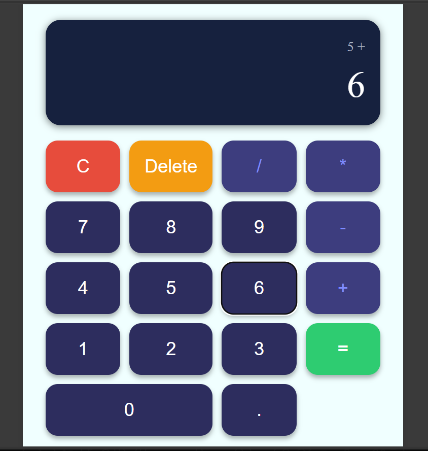

# Calculator App

A simple and responsive calculator built with HTML, CSS, and JavaScript. It performs basic arithmetic operations and supports both button clicks and keyboard input.

## Features

- Addition, subtraction, multiplication, and division
- Keyboard support
- Decimal number calculations
- Delete last digit functionality
- Clear all functionality
- Division by zero handling
- Responsive design for different screen sizes
- Clean and user-friendly interface

## Technologies Used

- HTML5
- CSS3
- JavaScript (Vanilla JS)

## Project Structure

```
calculator-app/
│
├── index.html
├── style.css
├── script.js
└── README.md
```

## Keyboard Shortcuts

| Key | Action |
|------|---------|
| 0-9 | Enter numbers |
| . | Decimal point |
| + | Addition |
| - | Subtraction |
| * | Multiplication |
| / | Division |
| Enter | Calculate result |
| Backspace | Delete last digit |
| Escape | Clear calculator |

## How to Run

1. Download or clone the repository.
2. Open the project folder.
3. Open `index.html` in your browser.

No installation or additional dependencies are required.

## Screenshots



## Author

Areej Fatima
